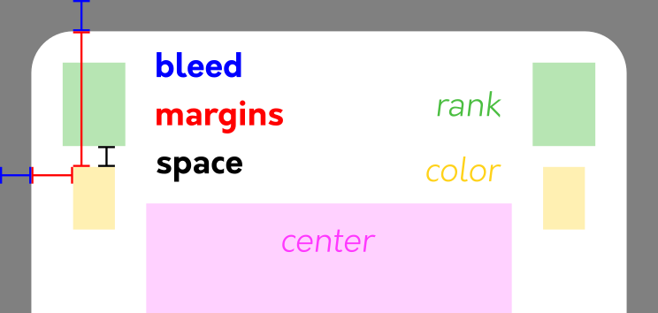

# Custom Cards Deck Generator


This Python program uses images from the `inputs` folder to automatically construct the images of standard cards and assemble them into a PDF. The layout of the cards in the generated PDF is designed to match the requirements for ordering custom playing card games on most printing websites.

### Configuration

The `config.json` file allows you to control various parameters. All units in this file are in millimeters (mm) and must be positive to work as intended. For reference, the dimensions of classic playing cards are 57 x 88 mm.

### Image Quality

By default, the program uses **300 PPP (pixels per inch)** for input images. While a lower PPP can speed up processing, it may reduce image quality. Higher PPP values will not significantly improve the quality of the cards but will increase processing time.

### Features

- Generate high-quality card images.
- Assemble cards into a PDF with layouts suitable for professional printing.
- Configure dimensions, image formats, and margins using a simple JSON file.

### How to Use

1. Replace my input images by yours in the `inputs` folder. Use the same image names as me or modify the `names` section in `config.json` accordingly.
2. Configure `options` and `dimensions` sections in `config.json` if needed.
3. Run `main.py`.

### Examples
You have a default PDF example in `res/example_default.pdf` and the following cards images in `res/cards_example/`.


**Note**: Images for **Q**:hearts: and **9**:spades: are made with `"verify margins": true` in `config.json` (*front_check.png* is used as front image). Those images are for visualizations only ! 
Images for **6**:diamonds: and **A**:clubs: are the ones you want inside your PDF.


## Configuration Parameters (`config.json`)

### Options

- **`"generate images"` (bool):** Determines whether card images should be generated.
- **`"generate pdf"` (bool):** Specifies whether PDFs should be generated.
- **`"pdf format"` (str):** Defines the format of the PDF file:
  - `"default"`: Only one back image at first page.
  - `"separated"`: One PDF with all the front images and another one with all the back images.
  - `"alternated"`: Alternating back and front images of each cards.
- **`"image format"` (str):** Specifies the file format for all generated images (e.g., `".png"`).
- **`"check margins"` (bool):** Uses `"front check"` instead of `"front"` in **Names** section as front image.

***Note**: I drew my margins in 'front_check.png' so I can use it with 'check margins' as 'true' to ensure design elements stay within them.*

### Dimensions

- **`"bleed"` (list):** Bleed area for cutting tolerances (e.g., `[3, 3]`).
- **`"margins"` (list):** Space between the card edge and the corner of color image (e.g., `[4.5, 12]`).
- **`"space"` (list):** Gap between rank and color images (e.g., `[0, 2]`).
- **`"PPP"` (int):** Pixels per inch (resolution) of inputs images, typically 300.

*For more details, see the image below.*

### Names

- **`"ranks"` (list of str):** Names of rank images (e.g., `["Q"]`).
- **`"colors"` (list of str):** Names of color folders (e.g., `["hearts"]`).
- **`"symbol"` (str):** Name of all symbol images.
- **`"front"` (str):** Name of the front card image.
- **`"front check"` (str):** Name of the front card image for margins verifications.
- **`"back"` (str):** Name of the back card image.

### Folders

- **`"inputs"` (str):** Folder containing input assets.
- **`"outputs"` (str):** Folder where generated files are saved.
- **`"images"` (str):** Subfolder within `outputs` for saving card images.

---

### Margins explanation




## Libraries

The program requires the following Python libraries:

- **numpy**: for efficient numerical operations.
- **Pillow (PIL)**: for handling and processing image files.
- **fpdf2**: to create and assemble the PDF containing the card images.
- **tqdm** *(optional)*: provides a progress bar for a better user experience. If not installed, you can safely remove its usage in the code manually.

To install all librairies :
``` bash
pip install numpy pillow fpdf2 tqdm
```

## Acknowledgements

- Open-source typeface **[Orkney Font](https://www.behance.net/gallery/34855701/Orkney-Open-Source-Typeface)**.
